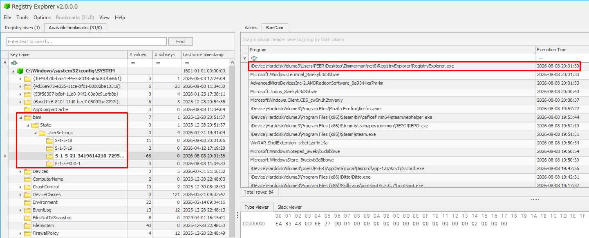

# Windows Background Activity Moderator (BAM) Registry as a DFIR Artifact

> Which Windows Registry artifact can help connect an executable, a timestamp, and a user context?

When investigating program execution on a Windows endpoint, artifacts such as Prefetch and Amcache usually receive most of the attention.

But there is another useful artifact worth checking:

**BAM — Background Activity Moderator**

## Overview

BAM was introduced in Windows 10 version 1709 to manage the activity of background applications.

Although it was not designed for forensic investigations, it can provide valuable evidence of recent program execution.

## Registry Location

The registry location on newer Windows versions is:

```text
HKLM\SYSTEM\CurrentControlSet\Services\bam\State\UserSettings\<SID>
```

On older Windows 10 versions, you may find it under:

```text
HKLM\SYSTEM\CurrentControlSet\Services\bam\UserSettings\<SID>
```

## What Can BAM Tell Us?

Each entry can provide:

- The full device path of an executed program
- Its last recorded execution timestamp
- The SID associated with the user context in which it ran

The timestamp is stored inside a `REG_BINARY` value as a 64-bit little-endian Windows FILETIME value in UTC. (Easily parsed using EZ Registry Explorer)

## Investigative Value

From an investigation perspective, BAM can help identify:

- Suspicious executables launched from AppData, Downloads, Temp, or other unusual locations
- Recently executed malware or unauthorized tools
- The user SID associated with the execution
- Activity that can strengthen an incident timeline

## Limitations

BAM has several important limitations:

- It records the most recent observed execution, not a complete execution history
- Entries may be removed during a reboot after approximately seven days
- Executables launched from network shares or removable media may not be recorded
- Entries associated with deleted executables may also be removed
- BAM does not provide the command line, parent process, or execution count

As always, one artifact should not tell the entire story.

Correlate BAM findings with Prefetch, Amcache, UserAssist, ShimCache, SRUM, Windows Event Logs, and EDR telemetry before reaching a conclusion.

## Key Takeaway

BAM may have a short retention window, but during a recent incident, it can provide exactly the missing link between an executable, a timestamp, and a user context.

## Simulation

Below you can see the execution of EZ Registry Explorer along with other executables I recently used on my laptop:
<br><br>


---
