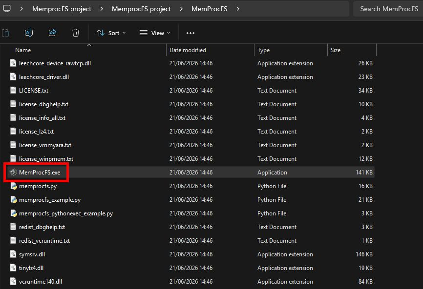
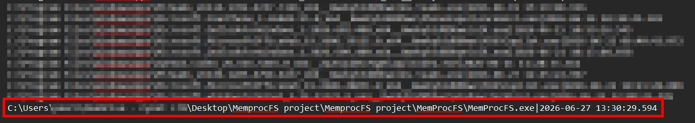

# Windows Program Compatibility Assistant (PCA) as a DFIR Artifact

> “It looks like this program didn’t run correctly. Would you like to try Compatibility Mode?”

Behind this small Windows notification is an interesting artifact for DFIR investigators:

**PCA — Program Compatibility Assistant**

## Overview

PCA was not originally designed for digital forensics.

It was created to help Windows identify software compatibility problems—particularly with older applications—and attempt to run those applications correctly.

However, like many artifacts created to improve the user experience, PCA can also become a valuable source of forensic evidence.

On Windows 11 version 22H2 and later, relevant PCA data may be found under:

```text
C:\Windows\appcompat\pca
```

One of the important files in this directory is:

```text
PcaAppLaunchDic.txt
```

## PcaAppLaunchDic.txt

This file may contain:

- The full path of an executed `.exe` file
- A timestamp recorded in UTC

This becomes useful during an investigation because the important question is not always:

> Does the file still exist?

Instead, investigators may need to determine:

- Was the executable launched?
- From which location was it launched?
- Was it executed from removable media, such as a USB drive?
- Does its execution time align with the rest of the forensic timeline?

## Example

An entry may look similar to the following:

```text
C:\Users\User\Downloads\AnyDesk.exe | 2026-06-20 08:14:33
```

This entry alone does not prove that a system was compromised.

However, when correlated with the forensic timeline, indicators of compromise, attacker TTPs, authentication data, and additional forensic artifacts, it can help investigators evaluate whether the executable was legitimate and draw better-supported conclusions.

This is where PCA becomes valuable.

## Limitations

PCA does not record every type of activity, and its evidence should not be analyzed in isolation.

Important limitations include:

- PCA is not designed to record the opening of documents or directories.
- Executions initiated through Command Prompt or PowerShell may not always appear.
- Executions initiated by services or scheduled tasks may not be recorded.
- Behavior may vary depending on the Windows version, build, and system configuration.
- PCA may retain only the most recent recorded execution of a particular executable.

Because of these limitations, PCA should not be used as the sole basis for a forensic conclusion.

Its data should be correlated with additional evidence to strengthen the overall timeline.

## Practical Example

In the simulation below, `MemProcFS` was executed manually.

Although MemProcFS is primarily a command-line tool, it was executed via GUI for demonstration purposes.



The PCA artifact indicates that it was executed at:


```text
13:30 UTC
```

This corresponds to:

```text
16:30 Israel time (UTC+3)
```



## Investigative Value

PCA can help answer questions related to executable activity, particularly when:

- The original executable has been deleted
- The executable was launched from an unusual directory
- Removable media may have been involved
- Investigators need to validate or strengthen an existing timeline
- Other execution artifacts are unavailable or incomplete

PCA should be treated as a supporting artifact rather than definitive proof.

Its real value comes from correlation with other forensic evidence.


---
