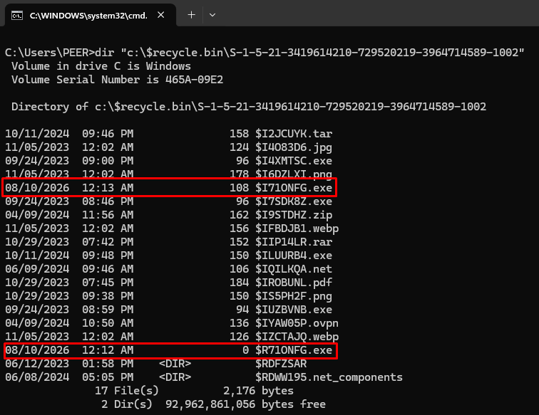
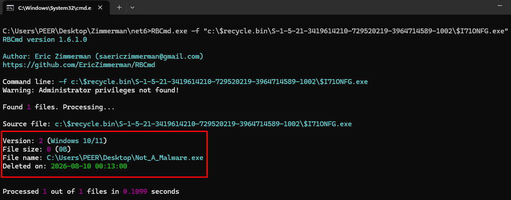

# Windows Recycle Bin as a DFIR Artifact

> What can Windows tell us about a file after the user deletes it?

When investigating deleted files on a Windows endpoint, one artifact is sometimes overlooked because of how familiar it seems:

The Windows Recycle Bin

Although the Recycle Bin was designed to allow users to recover accidentally deleted files, it can also provide valuable forensic evidence about deleted data.

## Overview

On modern Windows systems, each volume may contain a hidden system directory:

    `<Drive>:\$Recycle.Bin\`

Inside the directory, Recycle Bin data is separated by user SID:

    `<Drive>:\$Recycle.Bin\<SID>\`

For example:

    `C:\$Recycle.Bin\S-1-5-21-XXXXXXXXXX-XXXXXXXXXX-XXXXXXXXXX-1001\`

This can help associate Recycle Bin activity with a particular Windows user context.

When a file is normally moved to the Recycle Bin, Windows commonly creates two related artifacts:

    `$I<random>`

and:

    `$R<random>`

The random portion of the names connects the two files.

## $I and $R Files

The two files serve different purposes.

### $I File

The `$I` file contains metadata describing the deleted item.

It may provide:

* The original file or directory path
* The original file size
* The date and time the item was deleted

The deletion timestamp is stored as a Windows FILETIME value and represents the time the item was moved into the Recycle Bin.

This timestamp is especially useful when building a forensic timeline.

### $R File

The corresponding `$R` file contains the actual data associated with the deleted item.

This means investigators may have both:

> Information about where the file originally existed and the file content itself.

For example, an investigator may discover:

    `$IABC123.exe`

and:

    `$RABC123.exe`

The `$I` file could indicate that the original executable was located at:

    `C:\Users\User\Downloads\AnyDesk.exe`

while the corresponding `$R` file may still contain the executable itself.

## What Can the Recycle Bin Tell Us?

Recycle Bin artifacts can help answer questions such as:

* What file was deleted?
* Where was the file originally located?
* When was it deleted?
* What user context is associated with the Recycle Bin entry?
* Does the deleted file still exist inside the `$R` artifact?
* Was suspicious data removed shortly before or after other activity?
* Does the deletion align with the rest of the forensic timeline?

This can become particularly interesting when investigating attacker cleanup activity or attempts to remove evidence.

## Analyzing the Recycle Bin with RBCmd

One tool that can be used to parse Windows Recycle Bin metadata is `RBCmd`, created by Eric Zimmerman.

A single `$I` file can be analyzed using:

    RBCmd.exe -f "C:\Temp\$IABC123.exe"

For larger investigations, an entire collected Recycle Bin directory can be processed:

    RBCmd.exe -d "C:\Temp\RecycleBin" --csv "C:\Temp\RecycleBinOutput" --csvf RecycleBin.csv

RBCmd can parse the metadata contained inside `$I` files and provide information such as:

    Original Filename
    Original File Size
    Deletion Time

Forensic analysis should preferably be performed against a collected copy or mounted forensic image rather than modifying evidence on the live system.

## Practical Example

Imagine that during an investigation, evidence suggests that `AnyDesk.exe` was downloaded and later removed from the system.

Inside the user's Recycle Bin directory, the investigator discovers a matching `$I` and `$R` pair.

Parsing the `$I` artifact reveals an original path similar to:

    `C:\Users\User\Downloads\AnyDesk.exe`

along with a deletion timestamp.

The corresponding `$R` file still contains the deleted executable.

This provides multiple useful pieces of evidence:

* `AnyDesk.exe` previously existed on the endpoint
* Its original location can be identified
* The approximate time it was deleted can be added to the forensic timeline
* The deleted executable may still be available for hashing or additional analysis

However, this does not automatically mean the executable was malicious.

The deletion could have been performed by the user, an administrator, security software, an attacker, or another process.

Context matters.

## Investigative Value

Recycle Bin artifacts can be particularly useful when:

* A suspicious file has been deleted
* An attacker may have attempted to clean up tools after execution
* Documents or archives were removed after possible data staging
* Investigators need to determine the original location of a deleted file
* A deletion timestamp needs to be added to the forensic timeline
* The original file content may still be recoverable from the `$R` artifact
* Activity needs to be associated with a particular user's Recycle Bin directory

Consider an investigation where several suspicious files are deleted within minutes of an attacker disconnecting from the endpoint.

Recycle Bin timestamps could help strengthen evidence of cleanup activity.

The findings should then be correlated with artifacts such as:

* $MFT
* $UsnJrnl
* Prefetch
* Program Compatibility Assistant (PCA)
* LNK files
* Jump Lists
* ShellBags
* Windows Event Logs
* PowerShell logs
* EDR telemetry

Correlation is especially important because the Recycle Bin records deletion-related activity, but it does not explain why the deletion occurred.

## Limitations

The Recycle Bin has several important limitations:

* Not every deleted file is sent to the Recycle Bin.
* `Shift + Delete` can bypass the Recycle Bin.
* Command-line or programmatic deletion methods may bypass it.
* Emptying the Recycle Bin can remove the active `$I` and `$R` artifacts.
* The deletion timestamp represents when the item was moved to the Recycle Bin, not when the file was originally created or modified.
* The presence of a deleted file does not prove malicious activity.

The absence of a Recycle Bin artifact also does not prove that a file was never deleted.

Different deletion methods can leave evidence in different locations.

## Key Takeaway

The Windows Recycle Bin is more than a place for temporarily deleted files.

From a DFIR perspective, it can provide an important connection between:

> What was deleted, where it originally existed, when it was deleted, and which user context was associated with the artifact.

Combined with $MFT, $UsnJrnl, execution artifacts, Windows Event Logs, and EDR telemetry, Recycle Bin evidence can become an important part of reconstructing file deletion and cleanup activity.

## Simulation

A simple simulation can be performed by creating a test file such as:

    `C:\Windows\Temp\Not_A_Malware.exe`

Delete the file normally using Windows Explorer.

The user's SID can be identified using:

    whoami /user

Then examine the corresponding directory:

    `C:\$Recycle.Bin\<SID>\`

A new `$I` and `$R` pair should be associated with the deleted file.

Parse the collected `$I` artifact with RBCmd and compare:

    Original Path
    File Size
    Deletion Time

with the corresponding `$R` file.

This demonstrates how a simple file deletion can leave behind useful forensic evidence even after the original file disappears from its previous location.

---
